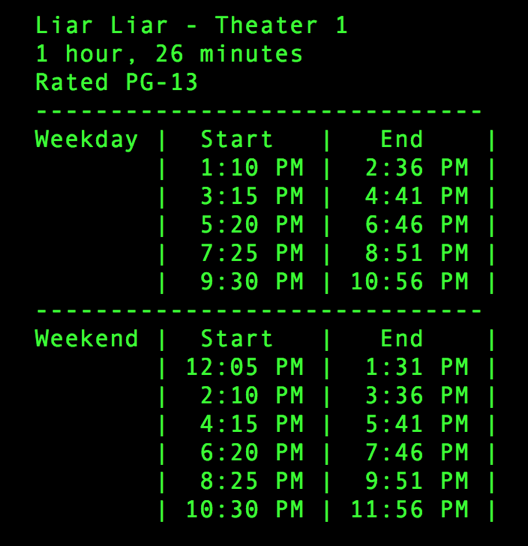

# Movie Scheduler Challenge

## INTRODUCTION
-------------------------------------------

It’s your first day on the job working for a small theater (lets call it...AMC River East). The multiplex contains multiple screens, each playing a different movie throughout the day. Managing the schedule can be a difficult task as there are staffing considerations with regard to setup, cleaning, projector operation, ticket sales and line management.

Mildred has been manually doing the schedule to make sure things run smoothly, but she’s planning to retire. Because the theatre is looking to add more screens, and possibly a second location, they’d like to design a system to handle the scheduling rather than rely on a person to do the job. Below are the rules Mildred provided upon being asked exactly how she schedules runtimes for each screen.

 
 

## SYSTEM DEFINITION
-------------------------------------------

### Movie Rules

Here is a list of the rules for each viewing of a movie.

- Each movie should start at easy to read times (eg 10:00, 10:05, 10:10).
- The start time of the movie is exactly at the posted start time.
- Each movie requires 15 minutes for previews before the start of the movie.
- Each movie requires 20 minutes after its end time to prepare the theatre for the next
movie 5.

### Theatre Rules

Here is a list of rules that are global to the cinema:

- The cinema requires 15 minutes after opening before the  rst movie is shown.
- No movie should end after the cinema’s hours of operation.
- The last showing should end as close as possible to the end of the cinema’s hours of
operation.

### Hours of Operation

The theatre has the following hours of operation.

- Monday - Thursday, 11am - 11pm. 
- Friday - Sunday, 10:30 am - 12 am.

 
 

## REQUIREMENTS
-------------------------------------------

You will have the user start their program by typing `ruby runner.rb` into the home folder from terminal.

Your system should be able to take in the details of each movie from the movie_list.json file and calculate a start and end time of each showing that abides by all of the provided rules. The runtime of each movie does not include time for previews or cleanup.

You must store these calculated times in a separate json or CSV file.

Your App will be interactive in the terminal, asking questions to the user, taking in input and printing data to the terminal in an attractive format.

 
 

 
 

## Make your own README.md
-------------------------------------------

Once you complete the ruby app, modify this readme to instruct your users how to set up the program from their computer.

- install instructions
- how to start the program
- examples of what to type in to the terminal
- examples of what to expect as output to terminal

[Check out these tricks](https://guides.github.com/features/mastering-markdown/) to add formatting to your github markdown file.

 
 

## Personal Touches
-------------------------------------------
When you are done. Ask yourself how you can make this your own. Don't break anything that is required for the challenge. Adding some personal flair is a good way to get noticed.

- colored text
- animations
- more features
- the ability to adjust the schedule with a password
- add scheduling staff option so you know how many positions are required to clean each theater, knowing they need 2 people to clean each theater and they can not be two places at once.
- etc.